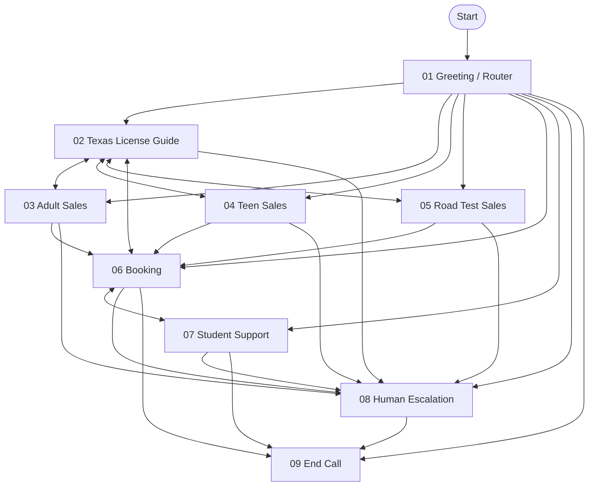

# Manual Retell visual flow

Manual design documentation only. No Retell agent, workflow, state or tools have been created or modified.

NODE 00 global configuration applies throughout. Diagram is documentation, not a workflow import; complete edge conditions are in handoff_matrix.md.

Explicit changed goals reroute through 01 from specialists; temporary detours preserve shared context and revalidate slots on return. Human request takes priority. Demo confirmations stay synthetic; production-safe reads are provisional and writes go to staff. Diagram edges do not imply deployed APIs.
